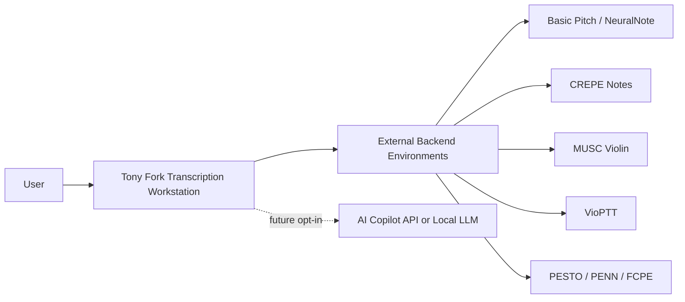

```mermaid
flowchart LR
    U[User] --> A[Tony Fork Transcription Workstation]
    A --> B[External Backend Environments]
    B --> BP[Basic Pitch / NeuralNote]
    B --> CN[CREPE Notes]
    B --> M[MUSC Violin]
    B --> V[VioPTT]
    B --> F[PESTO / PENN / FCPE]
    A -. future opt-in .-> AI[AI Copilot API or Local LLM]
``` 
